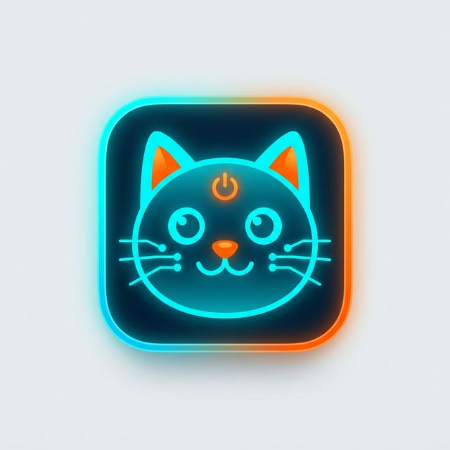

# 🐱 CoppyCat

<p align="center">
  
</p>

<p align="center">
  <strong>The King of Copy-Paste - A blazing-fast Clipboard Manager for macOS.</strong>
</p>

---

CoppyCat is a lightweight, stealthy Menu Bar application built with Electron. It continuously stalks your clipboard, saves your copy history (both text and images), and provides advanced text-parsing "claws" to supercharge your workflow.

## ✨ "Cat Scratch" Features

- **👻 Stealth Stalking**: Silently monitors your clipboard in the background without draining a single drop of your CPU.
- **🖼️ X-Ray Vision (Image Support)**: Natively captures and displays mini previews for copied images instantly.
- **⚡ God-like Shortcut**: Press `Cmd + Shift + C` (or `Ctrl + Shift + C`) in any app to summon the cat right at your mouse cursor.
- **🔍 The Toolkit Paws**:
  - **Link Scavenger**: Filter and extract all URLs hidden in a messy wall of text.
  - **JSON Beautifier**: Auto-format ugly, minified JSON into clean, indented code with one click.
- **💾 Goldfish Memory? Covered.**: Your clipboard history is permanently saved to your local drive. Reboot your Mac worry-free!

## 🚀 Installation

1. Go to the [Releases](../../releases) page.
2. Download the latest `CoppyCat.dmg` file.
3. Open the `.dmg` and drag the **CoppyCat** icon into your `Applications` folder.
4. Launch the app and enjoy! *(Note: Please grant Accessibility/Clipboard permissions when macOS asks).*

## 💻 Build from Source

```bash
# Install dependencies
npm install

# Run locally in development mode
npm start

# Build the macOS DMG package
npm run build
```

## 🏗️ Architecture

Built with Electron.js, leveraging the `clipboard` module, a highly secure `preload.js` Context Bridge, and a gorgeous macOS-native CSS Blur UI. Purr-fectly crafted!
